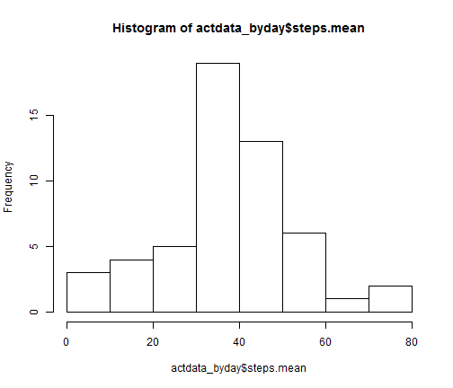

Title
========================================================

install.packages("knitr")

Load the data into R

```r
actdata <- read.csv("C:/Users/Chris Curran.ThinkPadCC/Documents/GitHub/RepData_PeerAssessment1/activity.csv")
```

Clean data in preparation for graphing

```r
install.packages("doBy")
```

```
## Installing package into 'C:/Users/Chris Curran.ThinkPadCC/Documents/R/win-library/3.0'
## (as 'lib' is unspecified)
```

```
## Error in contrib.url(repos, "source"): trying to use CRAN without setting a mirror
```

```r
library(doBy)
```

```
## Loading required package: survival
## Loading required package: splines
## Loading required package: MASS
```

```r
actdata_byday <- summaryBy(steps ~ date, FUN=c(mean, median), data=actdata)
```


Create a histogram of the total number of steps taken each day

```r
hist(actdata_byday$steps.mean)
```

 

Output the mean and median number of steps taken per day

```r
actdata_byday
```

```
##          date steps.mean steps.median
## 1  2012-10-01         NA           NA
## 2  2012-10-02  0.4375000            0
## 3  2012-10-03 39.4166667            0
## 4  2012-10-04 42.0694444            0
## 5  2012-10-05 46.1597222            0
## 6  2012-10-06 53.5416667            0
## 7  2012-10-07 38.2465278            0
## 8  2012-10-08         NA           NA
## 9  2012-10-09 44.4826389            0
## 10 2012-10-10 34.3750000            0
## 11 2012-10-11 35.7777778            0
## 12 2012-10-12 60.3541667            0
## 13 2012-10-13 43.1458333            0
## 14 2012-10-14 52.4236111            0
## 15 2012-10-15 35.2048611            0
## 16 2012-10-16 52.3750000            0
## 17 2012-10-17 46.7083333            0
## 18 2012-10-18 34.9166667            0
## 19 2012-10-19 41.0729167            0
## 20 2012-10-20 36.0937500            0
## 21 2012-10-21 30.6284722            0
## 22 2012-10-22 46.7361111            0
## 23 2012-10-23 30.9652778            0
## 24 2012-10-24 29.0104167            0
## 25 2012-10-25  8.6527778            0
## 26 2012-10-26 23.5347222            0
## 27 2012-10-27 35.1354167            0
## 28 2012-10-28 39.7847222            0
## 29 2012-10-29 17.4236111            0
## 30 2012-10-30 34.0937500            0
## 31 2012-10-31 53.5208333            0
## 32 2012-11-01         NA           NA
## 33 2012-11-02 36.8055556            0
## 34 2012-11-03 36.7048611            0
## 35 2012-11-04         NA           NA
## 36 2012-11-05 36.2465278            0
## 37 2012-11-06 28.9375000            0
## 38 2012-11-07 44.7326389            0
## 39 2012-11-08 11.1770833            0
## 40 2012-11-09         NA           NA
## 41 2012-11-10         NA           NA
## 42 2012-11-11 43.7777778            0
## 43 2012-11-12 37.3784722            0
## 44 2012-11-13 25.4722222            0
## 45 2012-11-14         NA           NA
## 46 2012-11-15  0.1423611            0
## 47 2012-11-16 18.8923611            0
## 48 2012-11-17 49.7881944            0
## 49 2012-11-18 52.4652778            0
## 50 2012-11-19 30.6979167            0
## 51 2012-11-20 15.5277778            0
## 52 2012-11-21 44.3993056            0
## 53 2012-11-22 70.9270833            0
## 54 2012-11-23 73.5902778            0
## 55 2012-11-24 50.2708333            0
## 56 2012-11-25 41.0902778            0
## 57 2012-11-26 38.7569444            0
## 58 2012-11-27 47.3819444            0
## 59 2012-11-28 35.3576389            0
## 60 2012-11-29 24.4687500            0
## 61 2012-11-30         NA           NA
```

Create a dataset collapsed by the mean steps per time interval across days

```r
actdata_byinterval <- summaryBy(steps ~ interval, FUN=c(mean, median), data=actdata, na.rm = TRUE)
```


```r
plot(actdata_byinterval$interval, actdata_byinterval$steps.mean, type="l")
```

 
The 835 interval contains the most steps on average.

Counting the number of missing values.

```r
sum(is.na(actdata$steps))
```

```
## [1] 2304
```

Replace missing values with the overall mean

```r
actdata2<-actdata
actdata2$steps[is.na(actdata2$steps)] <- mean(actdata2$steps, na.rm=TRUE)

actdata2_byday <- summaryBy(steps ~ date, FUN=c(mean, median), data=actdata2)
```


Create a histogram of the total number of steps taken each day without missing values

```r
hist(actdata2_byday$steps.mean)
```

 

The distribution looks roughly the same with and without the missing variables.

Since I used the overall average to impute, it pulled up the average for some days and pulled down the average for others.


Display the mean and median

```r
actdata2_byday
```

```
##          date steps.mean steps.median
## 1  2012-10-01 37.3825996      37.3826
## 2  2012-10-02  0.4375000       0.0000
## 3  2012-10-03 39.4166667       0.0000
## 4  2012-10-04 42.0694444       0.0000
## 5  2012-10-05 46.1597222       0.0000
## 6  2012-10-06 53.5416667       0.0000
## 7  2012-10-07 38.2465278       0.0000
## 8  2012-10-08 37.3825996      37.3826
## 9  2012-10-09 44.4826389       0.0000
## 10 2012-10-10 34.3750000       0.0000
## 11 2012-10-11 35.7777778       0.0000
## 12 2012-10-12 60.3541667       0.0000
## 13 2012-10-13 43.1458333       0.0000
## 14 2012-10-14 52.4236111       0.0000
## 15 2012-10-15 35.2048611       0.0000
## 16 2012-10-16 52.3750000       0.0000
## 17 2012-10-17 46.7083333       0.0000
## 18 2012-10-18 34.9166667       0.0000
## 19 2012-10-19 41.0729167       0.0000
## 20 2012-10-20 36.0937500       0.0000
## 21 2012-10-21 30.6284722       0.0000
## 22 2012-10-22 46.7361111       0.0000
## 23 2012-10-23 30.9652778       0.0000
## 24 2012-10-24 29.0104167       0.0000
## 25 2012-10-25  8.6527778       0.0000
## 26 2012-10-26 23.5347222       0.0000
## 27 2012-10-27 35.1354167       0.0000
## 28 2012-10-28 39.7847222       0.0000
## 29 2012-10-29 17.4236111       0.0000
## 30 2012-10-30 34.0937500       0.0000
## 31 2012-10-31 53.5208333       0.0000
## 32 2012-11-01 37.3825996      37.3826
## 33 2012-11-02 36.8055556       0.0000
## 34 2012-11-03 36.7048611       0.0000
## 35 2012-11-04 37.3825996      37.3826
## 36 2012-11-05 36.2465278       0.0000
## 37 2012-11-06 28.9375000       0.0000
## 38 2012-11-07 44.7326389       0.0000
## 39 2012-11-08 11.1770833       0.0000
## 40 2012-11-09 37.3825996      37.3826
## 41 2012-11-10 37.3825996      37.3826
## 42 2012-11-11 43.7777778       0.0000
## 43 2012-11-12 37.3784722       0.0000
## 44 2012-11-13 25.4722222       0.0000
## 45 2012-11-14 37.3825996      37.3826
## 46 2012-11-15  0.1423611       0.0000
## 47 2012-11-16 18.8923611       0.0000
## 48 2012-11-17 49.7881944       0.0000
## 49 2012-11-18 52.4652778       0.0000
## 50 2012-11-19 30.6979167       0.0000
## 51 2012-11-20 15.5277778       0.0000
## 52 2012-11-21 44.3993056       0.0000
## 53 2012-11-22 70.9270833       0.0000
## 54 2012-11-23 73.5902778       0.0000
## 55 2012-11-24 50.2708333       0.0000
## 56 2012-11-25 41.0902778       0.0000
## 57 2012-11-26 38.7569444       0.0000
## 58 2012-11-27 47.3819444       0.0000
## 59 2012-11-28 35.3576389       0.0000
## 60 2012-11-29 24.4687500       0.0000
## 61 2012-11-30 37.3825996      37.3826
```


Create a weekdays measure

```r
actdata2$day <- weekdays(as.Date(actdata2$date, "%Y-%m-%d"))
actdata2$weekday <- 1
actdata2$weekday[actdata2$day == "Sunday"] <- 0
actdata2$weekday[actdata2$day == "Saturday"] <- 0
actdata2weekday_byinterval <- summaryBy(steps ~ interval, FUN=c(mean, median), data=actdata2[actdata2$weekday ==1,])
actdata2weekend_byinterval <- summaryBy(steps ~ interval, FUN=c(mean, median), data=actdata2[actdata2$weekday ==0,])
```

Plot data by weekday status

```r
par(mfrow=c(2,1)) 
plot(actdata2weekday_byinterval$interval, actdata2weekday_byinterval$steps.mean, type="l")
plot(actdata2weekend_byinterval$interval, actdata2weekend_byinterval$steps.mean, type="l")
```

 


